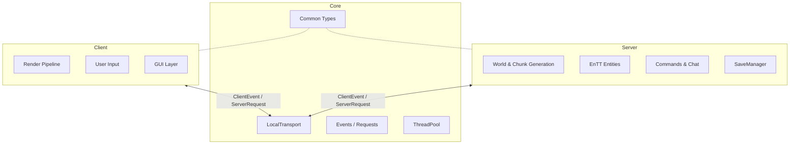
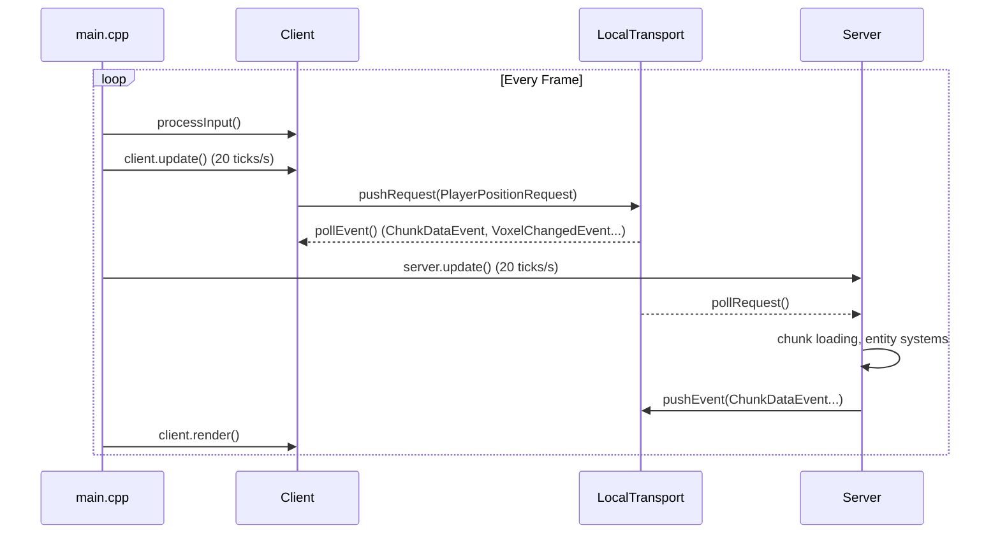
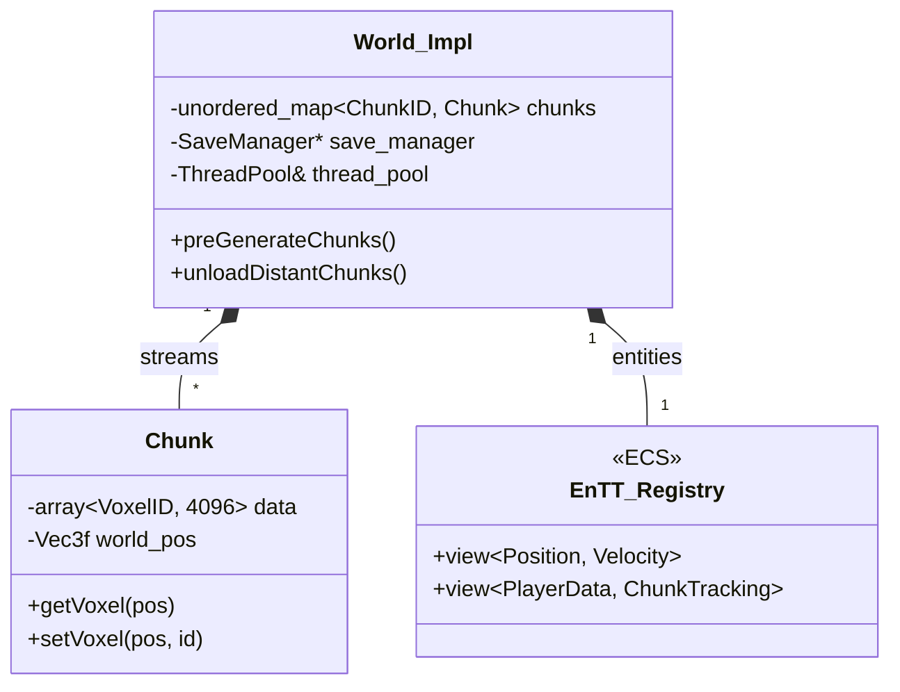
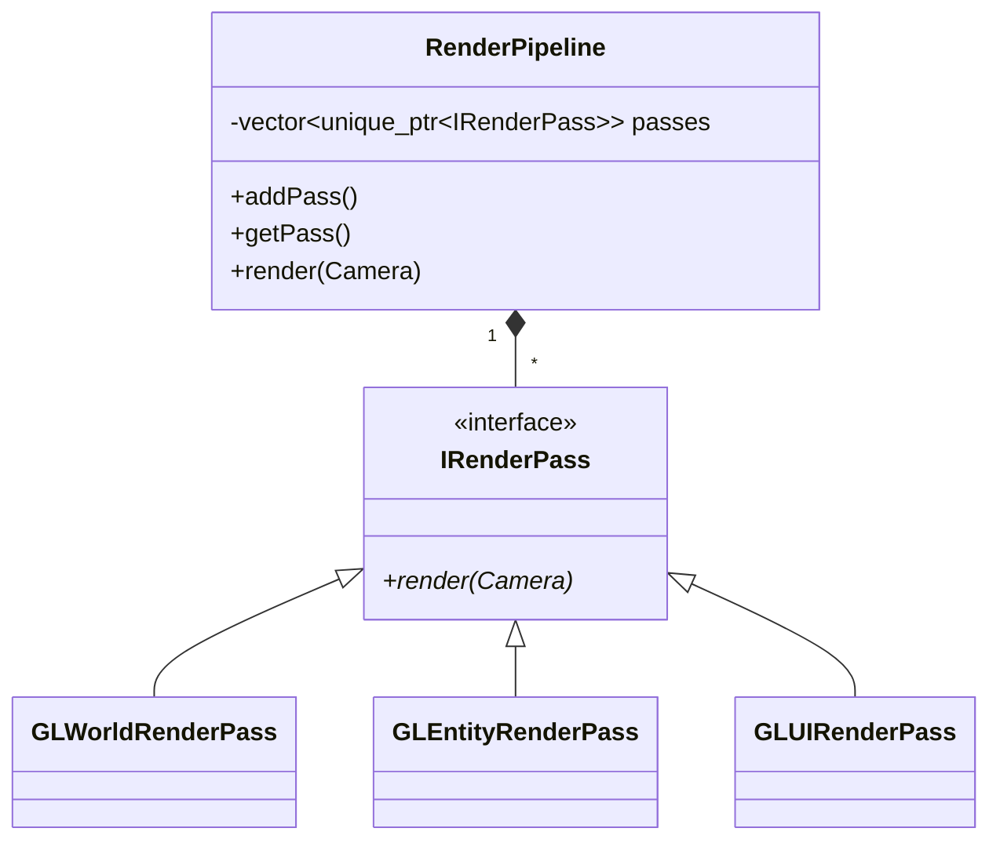

# Voxel Engine Architecture

This file explains how the project is organized and how the main parts work together.

## 1. Modules

The engine is split into 3 libraries:

- **Core**: shared types (chunks, voxel types, math), the client/server messages and the thread pool. No rendering, no game logic.
- **Server**: the "real" world state. Chunk generation, entities, saving/loading, chat and commands.
- **Client**: OpenGL rendering, input and the GUI (Dear ImGui).

The idea is to be able to add online multiplayer later, so the client and the server only talk through messages.

Note: the client library still links to the server library for now (leftover from before the split), it's something to remove.

### Client/Server messages

The client sends `ServerRequest`s (move player, place a block, load a world, send a chat message...) and the server sends back `ClientEvent`s (chunk data, block changed, entity moved...). Both are `std::variant`s and are handled with `std::visit`.

In single player they go through `LocalTransport`, which is just two queues protected by a mutex. For online multiplayer the plan is to replace it with sockets and serialize the messages, without touching the rest of the code.

## 2. Game loop

Everything runs on the main thread except chunk generation (see section 4). The client and the server both update at 20 ticks per second, the rendering is not capped.

## 3. World and chunks

- A chunk is 16x16x16 voxels stored in one flat `std::array` (index = `(y * 16 + z) * 16 + x`). A voxel is just a `uint8_t` id pointing to a voxel type (air, dirt, water...).
- The world is a hash map of chunks. Chunks are loaded around each player and unloaded when they are too far.
- Entities use EnTT: components are simple structs (`Position`, `Velocity`, `Model`...) and systems are plain functions (e.g. `movement_system::update`).
- Public classes like `World`, `Server` and `Client` use the PIMPL pattern (`World::Impl`...), mostly to keep implementation details out of the headers.

## 4. Chunk streaming and threading

When a player enters a new chunk, the server lists the missing chunks around them and sorts them by distance, so the nearest ones come first.

- Chunks already saved on disk are loaded on the main thread (max 8 per tick).
- New chunks are generated with Perlin noise on a thread pool (`ThreadPool` in core). The workers put finished chunks in a shared "outbox" protected by a mutex, and the server picks them up at the next tick.
- Chunks being generated are tracked so they are never asked for twice, and chunks the player already left are dropped.

On the client, building all the meshes of new chunks at once was making the game lag. So each frame the client builds the meshes in priority order (visible and nearest first) and stops after 2ms of work, the rest waits for the next frame.

Numbers are in [PERFORMANCE.md](PERFORMANCE.md).

## 5. Rendering

The client uses a render pipeline made of separate passes instead of one big render function:

- **World pass**: one mesh per chunk. Only the faces next to air or a transparent block are added (no greedy meshing yet). Chunks outside of the camera view are not drawn (frustum culling). Block textures are in a texture array.
- **Entity pass**: entity models loaded from `.obj` files.
- **UI pass**: the crosshair. The menus and the chat use Dear ImGui, drawn after the pipeline.
- OpenGL buffers are wrapped in a `GLMesh` class that frees them in its destructor.

## 6. Saving

Each world is a folder in `worlds/<world_name>/`:

- `world.meta`: format version, seed, voxel types and known players.
- `chunks/<x>_<z>.dat`: one file per chunk, the raw voxel array compressed with zlib.

A chunk is only written to disk if it changed since its last save (when it's unloaded or when the world is saved).

## 7. Commands

Chat commands (`/fill`, `/cow`...) are registered in a `CommandRegistry` as lambdas. They get a `CommandContext` to access the world and report errors.

## 8. Tests

Tests use GoogleTest (`./build/tests/voxel_tests`). For now they cover the chunk streaming (no duplicate chunks, far chunks dropped, world deleted while chunks are being generated) and the mesh builder.
